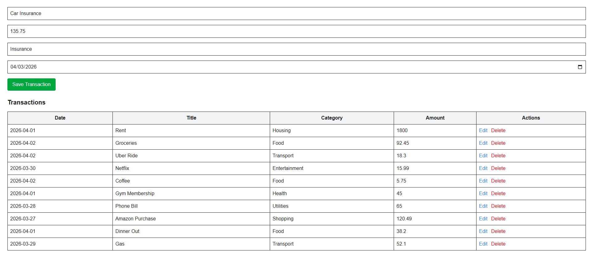

# Spending Analytics Dashboard

A full-stack web application for tracking, managing, and analyzing personal spending. Built with Next.js, React, TypeScript, Tailwind CSS, and Supabase.

## Demo

## Features

- Create, read, update, and delete transactions
- Real-time UI updates after creating, editing, and deleting entries
- Edit transactions via modal interface
- API routes using Next.js App Router
- Supabase integration with PostgreSQL
- Row Level Security (RLS) for secure data access

## Tech Stack

- Next.js (App Router)
- React
- TypeScript
- Tailwind CSS
- Supabase (PostgreSQL)

## Project Structure

src/app/api/transactions/route.ts → GET, POST  
src/app/api/transactions/[id]/route.ts → PUT, DELETE  
src/app/transactions/page.tsx → Main dashboard page  

src/components/ → UI components  
src/lib/supabase.ts → Supabase client  

## API Endpoints

- GET `/api/transactions` → Fetch all transactions  
- POST `/api/transactions` → Create a transaction  
- PUT `/api/transactions/[id]` → Update a transaction  
- DELETE `/api/transactions/[id]` → Delete a transaction  

## Environment Variables

Create a `.env.local` file:

NEXT_PUBLIC_SUPABASE_URL=your_supabase_url  
NEXT_PUBLIC_SUPABASE_ANON_KEY=your_supabase_anon_key  

## Getting Started

npm install  
npm run dev  

Then open: http://localhost:3000  

## Current Progress

- Transaction creation and deletion  
- Transaction editing via modal  
- Full CRUD API implementation  
- Supabase database integration  
- UI updates synced with backend  

## Planned Features

- Data visualization (charts and analytics)  
- Category-based insights  
- Authentication  
- Improved UI/UX  
- Deployment (Vercel)  

## What I Learned

- Building full-stack apps with Next.js App Router  
- Designing RESTful APIs  
- Working with Supabase and PostgreSQL  
- Handling real-world debugging (RLS, API mismatches)  
- Managing state between frontend and backend  

## License

This project is for educational and portfolio purposes.
